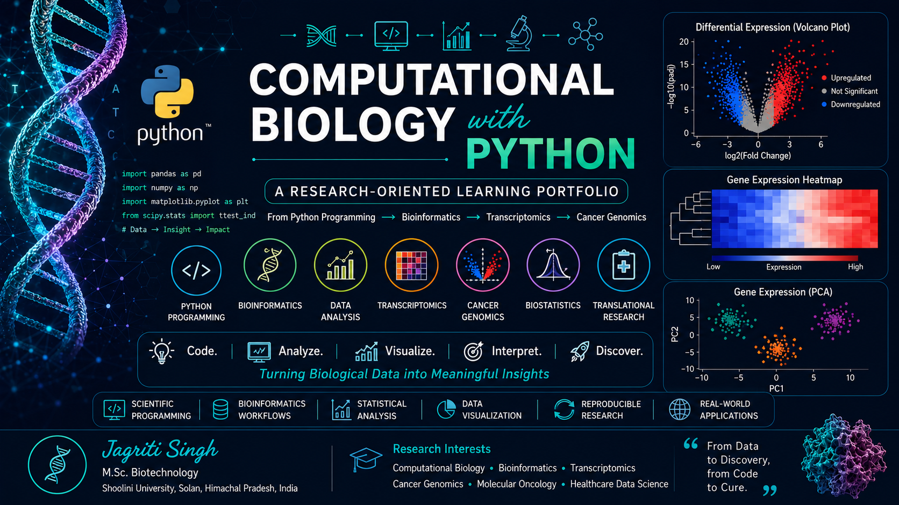

 **Computational Biology with Python**
 
 **A Research-Oriented Learning Portfolio**

This repository documents my journey of learning Python for computational biology, bioinformatics, biostatistics, transcriptomics, and healthcare data science.

Rather than focusing only on programming concepts, each notebook demonstrates how Python can be applied to solve real biological problems through data analysis, visualization, and reproducible scientific workflows.

The repository progresses from Python fundamentals to advanced applications in cancer genomics and transcriptomic data analysis, culminating in a capstone project on Lung Adenocarcinoma (LUAD).

**Learning Objectives**

Throughout this repository I aim to:

* Learn Python programming for biological research
* Apply programming to bioinformatics workflows
* Analyze genomic and transcriptomic datasets
* Perform statistical analysis of biological data
* Build reproducible computational biology projects
* Develop publication-quality scientific visualizations
* Strengthen skills for translational biomedical research

**Repository Structure**
Computational Biology with Python

  01_Python_Basics.ipynb
  
  02_Operators_and_User_Input.ipynb
  
  03_Conditional_Statements.ipynb
  
 04_Loops.ipynb
 
 05_Functions.ipynb
 
 06_Lists_Tuples.ipynb
 
 07_Dictionaries_and_Sets.ipynb
 
 08_File_Handling_Biological_Data.ipynb
 
 09_NumPy_Gene_Expression.ipynb
 
 10_Pandas_Biological_Data.ipynb
 
 11_Data_Visualization.ipynb
 
 12_Biostatistics.ipynb
 
 13_DNA_Sequence_Analysis.ipynb
 
 14_RNAseq_Differential_Expression.ipynb
 
 15_LUAD_Transcriptomics_Capstone.ipynb

**Skills Demonstrated**
* Python Programming
* NumPy
* Pandas
* Matplotlib
* File Handling
* Statistical Analysis
* Scientific Visualization
* Biological Data Processing
* Gene Expression Analysis
* Differential Expression Analysis
* Bioinformatics Workflows
* Reproducible Research

**Project Highlights**
* Python Fundamentals
* Biological Data Processing
* DNA Sequence Analysis
* Gene Expression Analysis
* RNA-seq Differential Expression
* Lung Adenocarcinoma Transcriptomics Capstone
* Publication-Style Executive Dashboard

**Learning Roadmap**

* Python Basics

* Operators and User Input

* Conditional Statements

* Loops

* Functions

* Lists and Tuples

* Dictionaries and Sets

* File Handling

* NumPy

* Pandas

* Data Visualization

* Biostatistics

* DNA Sequence Analysis

* RNA-seq Differential Expression

* LUAD Transcriptomics Capstone

**Future Directions**
Future projects planned for this portfolio include:
* Single-cell RNA-seq Analysis
* Multi-omics Data Integration
* Pathway Enrichment Analysis
* Survival Analysis
* Machine Learning for Cancer Genomics
* Biomarker Discovery Pipelines
* Clinical Bioinformatics

##  Author

**Jagriti Singh**

MSc Biotechnology

Shoolini University, Solan , Himachal Pradesh 
**Interested in:**
- Computational Biology
- Cancer Genomics
- Bioinformatics
- Biostatistics
- Healthcare Data Science

**MIT License**

Copyright (c) 2026 Jagriti Singh

Permission is hereby granted, free of charge, to any person obtaining a copy
of this software and associated documentation files (the "Software"), to deal
in the Software without restriction, including without limitation the rights
to use, copy, modify, merge, publish, distribute, sublicense, and/or sell
copies of the Software, and to permit persons to whom the Software is
furnished to do so, subject to the following conditions:

The above copyright notice and this permission notice shall be included in all
copies or substantial portions of the Software.

THE SOFTWARE IS PROVIDED "AS IS", WITHOUT WARRANTY OF ANY KIND, EXPRESS OR
IMPLIED, INCLUDING BUT NOT LIMITED TO THE WARRANTIES OF MERCHANTABILITY,
FITNESS FOR A PARTICULAR PURPOSE AND NONINFRINGEMENT. IN NO EVENT SHALL THE
AUTHORS OR COPYRIGHT HOLDERS BE LIABLE FOR ANY CLAIM, DAMAGES OR OTHER
LIABILITY, WHETHER IN AN ACTION OF CONTRACT, TORT OR OTHERWISE, ARISING FROM,
OUT OF OR IN CONNECTION WITH THE SOFTWARE OR THE USE OR OTHER DEALINGS IN THE
SOFTWARE.
